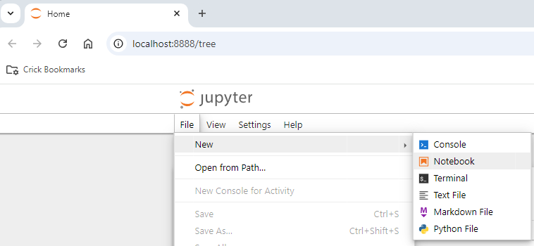
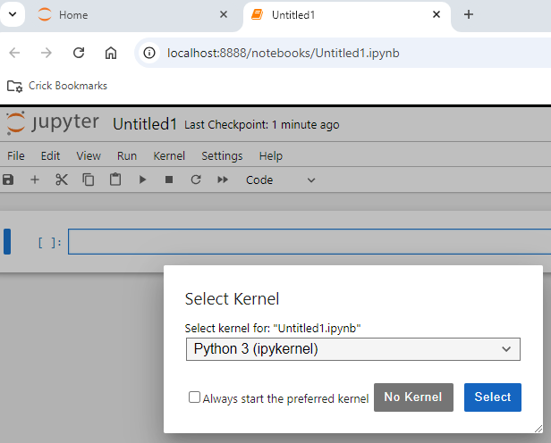
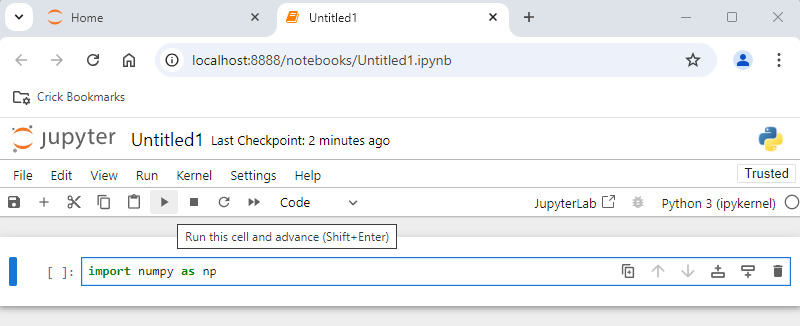

# Conda Environment Set-Up Instructions
### 3D Segmentation Workshop (MDIA 2025)

We need to set up a conda environment to run our 3D segmentation and analyse our resulting data using Jupyter notebooks.

#### YAML files
We will be using a .yml file to setup our conda environment.  YAML files (*Yet Another Markup Language*) describe the resources used and the template location to define the environment. It helps us record and share the details of the environment we use.

> Ensure you have the [calm-3dsegm.yml](calm-3dsegm.yml) file downloaded. The file includes the packages we will be using in the notebooks.

1. Make sure you first installed conda properly by following [these instructions](./../Pages/Installation-Instructions.md#installing-conda).

2. Open Anaconda Prompt (use *Terminal* on Macs) and navigate to wherever you saved and unzipped the workshop data.
    ```
    cd <path_to_unzipped_files>/FrancisCrickInstitute-multi-dimensional-imaging-and-analysis-*******/3D_Segmentation
    ```
    You'll need to replace `<path_to_unzipped_files>` with the location of the unzipped folder on your computer.
3. Type the following to create a new environment:
    ```
    conda env create -f calm-3dsegm.yml
    ```
4. Check that the environment was created:
    ```
    conda env list
    ```
5. Activate your new environment so you can use it:
    ```
    conda activate calm-3dsegm
    ```
6. Open Jupyter Lab and check that the installed packages can be correctly imported.
    ```
    jupyter lab
    ```
    When Jupyter lab opens in the web browser, open a new notebook with File/New/Notebook
<p align="center">
  
</p>

&nbsp;&nbsp;&nbsp;&nbsp;&nbsp;&nbsp;Select a python kernel
<p align="center">
  
</p>
&nbsp;&nbsp;&nbsp;&nbsp;&nbsp;&nbsp;Type in one cell

  ```
    import numpy as np
  ```

&nbsp;&nbsp;&nbsp;&nbsp;&nbsp;&nbsp;and run
<p align="center">
    
</p>
&nbsp;&nbsp;&nbsp;&nbsp;&nbsp;&nbsp;If no error is found, it means that the package has been installed correctly.


<br>

For more information on using conda, see [Conda Documentation](https://conda.io/projects/conda/en/latest/user-guide/getting-started.html).
<br>

For a detailed explanation on Jupyter Lab, visit the [Jupyter Lab User Documentation](https://jupyterlab.readthedocs.io/en/latest/)

<br>
<hr>

### Bonus track: calling software installed in a different environment
If you have installed Jupyter Lab in one environment but want to call some software installed in a different environment, it is possible to run the notebook using a different kernel that will have access to the packages in the other environment. In general, to do so one needs to install ipython and ipykernel, but in our case they are already installed as dependencies with napari.

To make visible a different environment as a kernel, one would need to list it using the conda prompt. For example, if you have a specific version on napari installed in a conda environment called "napari-env":


  ```
  python -m ipykernel install --user --name napari-env --display-name "napari-env"
  ```
  and 
```
exit
```
from the ipython terminal (going back to conda prompt).

After relaunching Jupyter Lab, the new kernel should be visible.

