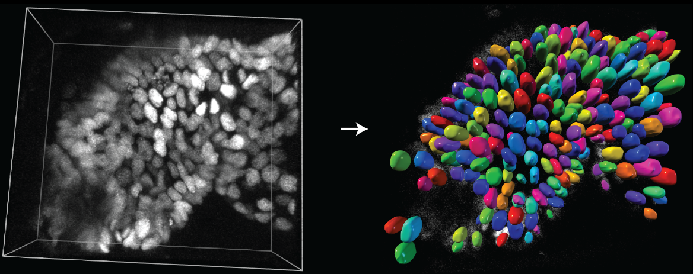

# 3D segmentation
#### 10th & 11th September 2025

  

## Slides
The slides used in the workshop are available in our [Dropbox](https://www.dropbox.com/scl/fo/51nqcssi6hvhd8bwkd5vf/AK9Ys1XvoGUCSpC2gu3fE0M?rlkey=j1kzznn3c1p2jltsxt7p1w91h&st=09jccm9y&dl=0).

* Introduction to napari and conda env creation - Rocco D'Antuono [slides](https://docs.google.com/presentation/d/13FnxLvyOiDoO1KNglLPJ_rvMMZurzkL4ad9YzchBZX0/edit?usp=sharing)
 

## Download
**Please download the files to a location on your hard drive that is easy to find!**

### Demo data

* [Image_Set_1_001.tif](./Image_Set_1_001.tif) - 2D Nucleus example
* [3d_monolayer_xy1_ch2.tif](./3d_monolayer_xy1_ch2.tif) - 3D Nucleus example

### Code
During the second part of the workshop, we will be using the following notebooks
* [Watershed_3DSegmentation.ipynb](./Watershed_3DSegmentation.ipynb) - Classical watershed segmentation with scikit-image - Jupyter notebook
* [StarDist_Demo.ipynb](./StarDist_Demo.ipynb) - StarDist Segmentation Jupyter Notebook
* [Data_Analysis.ipynb](./Data_Analysis.ipynb) - Data Analysis Jupyter Notebook

  
## Set up the conda environment
For this module, we will be using jupyter notebooks to run our 3D segmentation with classical watershed algorithm and StarDist deep learning model, and analyse the resulting data.

To do so, we will create a conda environment during the workshop following [these instructions](conda_env_setup.md).

