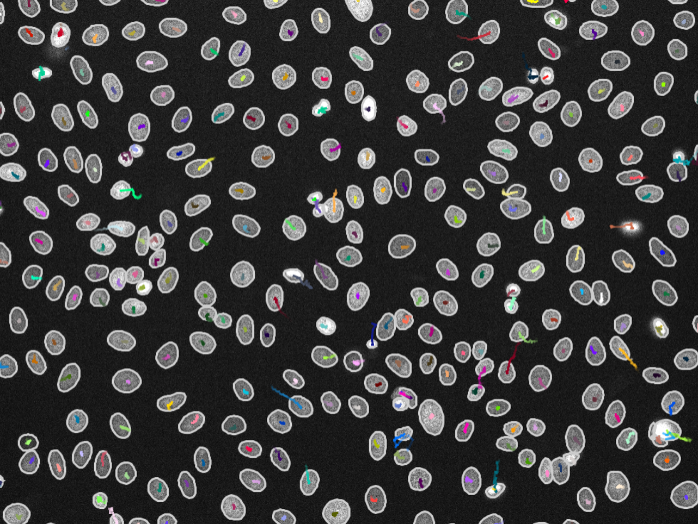

# Cell Tracking

<p align="center">
  
</p>

## Download slides (Optional)

All the slides that will be used in this session are [here](https://www.dropbox.com/scl/fi/cgp9ppeuoig5lsemmqe46/Tracking.pptx?rlkey=a29s2a3wx333nhbd5ktz8tvz2&st=xlaqi7is&dl=0).

## Download demo data

We're going to be working with some example datasets, which you can download from [here](https://www.dropbox.com/scl/fo/6ps6vv4yhm09zszrvg55x/AIAmiU20I5_W7mfirW8yeJA?rlkey=35p3v8txyk7z2p1833th4as37&st=77egkh54&dl=0).

## Notebook overview

We will use three Jupyter notebooks, ideally in the following order:

| Notebook | What it does | Biological question |
|---|---|---|
| `compare_track_data.ipynb` | Plots a chosen track metric (e.g. mean speed) across all imaging positions | Do cells in different positions show different motility? |
| `compare_FUCCI_markers.ipynb` | Detects intensity drops in two fluorescence channels and measures the time between them | How long do cells spend between G1/S-phase and M/G1-phase transitions? |
| `plot_fluorescence_profiles.ipynb` | Plots per-track fluorescence intensity profiles over time | How do the two FUCCI marker intensities change together over a single cell cycle? |

`compare_track_data.ipynb` is the simplest and best entry point. `compare_FUCCI_markers.ipynb` is the most complex — it introduces thresholding, sliding-window analysis, and frame-difference calculations. `plot_fluorescence_profiles.ipynb` is useful for exploring individual cell behaviour after running the other notebooks.

## Which data are we analysing?

The `TrackMate_Outputs/` folder contains data from a FUCCI (Fluorescence Ubiquitination-based Cell Cycle Indicator) live-cell imaging experiment. TrackMate exported two CSV types per position:

| File type | Content |
|---|---|
| `*_tracks.csv` | One row per tracked cell — metrics like speed, displacement, duration |
| `*_spots.csv` | One row per detection per frame — per-spot fluorescence intensities and coordinates |

The FUCCI system uses two markers:
- **Channel 2 (MEAN_INTENSITY_CH2)**: marks G1 phase
- **Channel 3 (MEAN_INTENSITY_CH3)**: marks S/G2/M phases

A drop in Channel 3 intensity indicates the M/G1 transition (cell division). The time between Channel 3 drop and the subsequent Channel 2 drop measures the G1-to-S transition duration.

## Set up conda environment

For this module, you need to set up a conda environment to analyse tracking data in Jupyter notebooks.

1. Make sure you first installed conda properly by following [these instructions](./../Pages/Installation-Instructions.md#installing-conda).
2. Make sure you have already downloaded all the scripts we will be using by clicking on the `tar` or `zip` icon on [this page](../README.md).
3. Open Anaconda Prompt (use `terminal` on Macs) and navigate to wherever you saved and unzipped the scripts in step #2 above:
    ```
    cd <path_to_unzipped_files>/FrancisCrickInstitute-multi-dimensional-imaging-and-analysis-*******/Live-Cell-Imaging-And-Tracking
    ```
    You'll need to replace `<path_to_unzipped_files>` with the location of the unzipped folder on your computer.
4. Type the following to create a new environment:
    ```
    conda create --name cell-tracking python=3.13
    ```
5. Check that the environment was created:
    ```
    conda env list
    ```
6. Activate your new environment so you can use it:
    ```
    conda activate cell-tracking
    ```
7. Install the necessary packages for this session:
    ```
    python -m pip install -r ./tracking_requirements.txt
    ```
8. Open Jupyter Lab:
    ```
    jupyter-lab
    ```

For more information on using conda, see [here](https://conda.io/projects/conda/en/latest/user-guide/getting-started.html).

For a detailed explanation on Jupyter Lab, visit the [Jupyter Lab User Documentation](https://jupyterlab.readthedocs.io/en/latest/)

## Run the Jupyter notebooks on Binder

[](https://mybinder.org/v2/gh/FrancisCrickInstitute/multi-dimensional-imaging-and-analysis/main?urlpath=lab/tree/Live-Cell-Imaging-And-Tracking)

[Binder](https://mybinder.org/) allows you to open notebooks stored in a GitHub repo in a remote executable environment, making your code immediately reproducible by anyone, anywhere.
