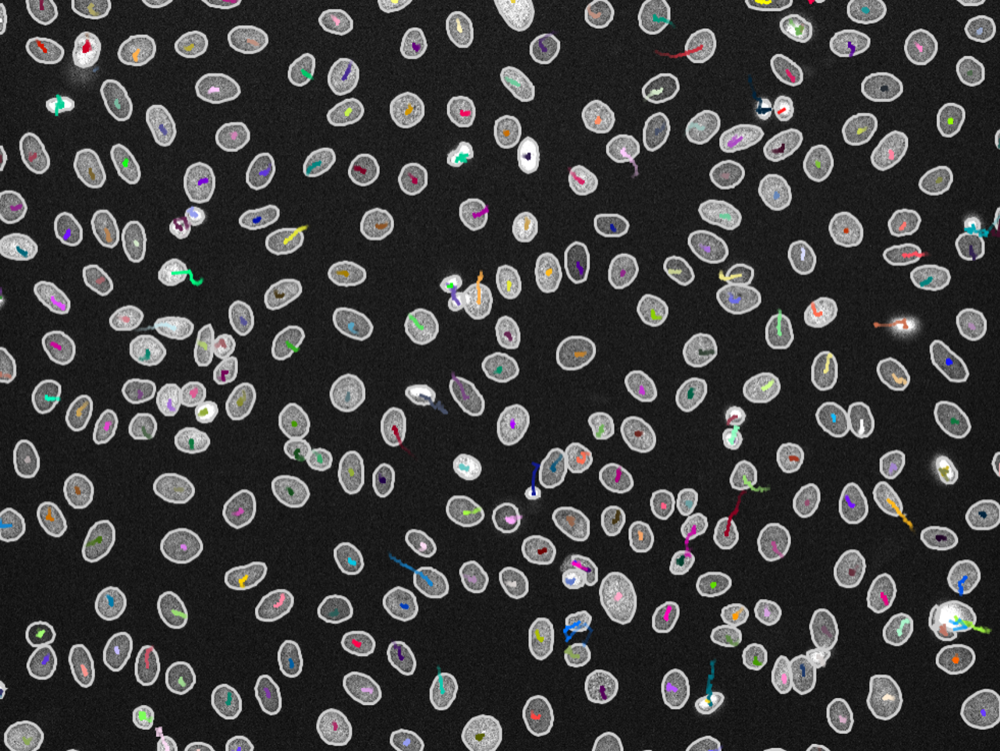

# Cell Tracking

<p align="center">
  
</p>

## Download slides (Optional)

All the slides that will be used in this session are [here](https://www.dropbox.com/scl/fi/cgp9ppeuoig5lsemmqe46/Tracking.pptx?rlkey=vi65nayeggrboqp0otd2h5y6w&dl=0).

## Download demo data

We're going to be working with some example datasets, which you can download from [here](https://www.dropbox.com/scl/fo/6ps6vv4yhm09zszrvg55x/AIAmiU20I5_W7mfirW8yeJA?rlkey=35p3v8txyk7z2p1833th4as37&dl=0).

## Set up conda environment

For this module, you need to set up a conda environment to analyse tracking data in Jupyter notebooks.

1. Make sure you first installed conda properly by following [these instructions](./../Pages/Installation-Instructions.md#installing-conda).
2. Open Anaconda Prompt (use `terminal` on Macs) and type the following to create a new environment:
    ```
    conda create --name cell-tracking python=3.13
    ```
3. Check that the environment was created:
    ```
    conda env list
    ```
4. Activate your new environment so you can use it:
    ```
    conda activate cell-tracking
    ```
5. Install the necessary packages for this session:
    ```
    python -m pip install -r ./tracking_requirements.txt
    ```
6. Open Jupyter Lab:
    ```
    jupyter-lab
    ```

For more information on using conda, see [here](https://conda.io/projects/conda/en/latest/user-guide/getting-started.html).

For a detailed explanation on Jupyter Notebook, visit the [Jupyter Notebook User Documentation](https://jupyter-notebook.readthedocs.io/en/latest/notebook.html)
