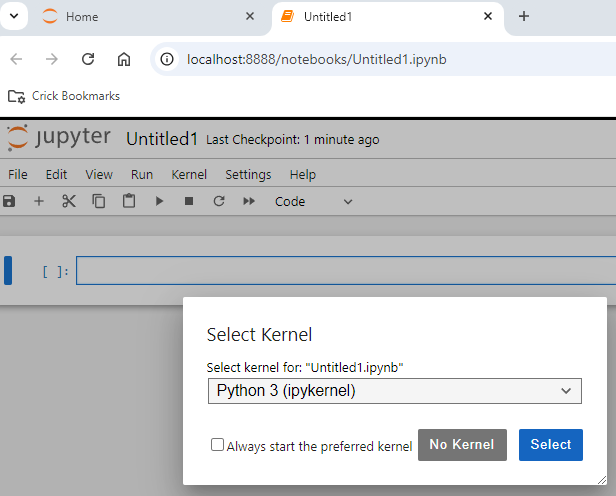

# Cell Tracking

<p align="center">
  
</p>

For this module, you need to set up a conda environment to analyse tracking data in Jupyter notebooks.

1. Make sure you first installed conda properly by following [these instructions](./../Pages/Installation-Instructions.md#installing-conda).
2. Open Anaconda Prompt and type the following to create a new environment:
    ```
    conda create --name cell-tracking python=3.12
    ```
3. Check that the environment was created:
    ```
    conda env list
    ```
4. Activate your new environment so you can use it:
    ```
    conda activate cell-tracking
    ```
5. Install the necessary packages for this session:
    ```
    conda install matplotlib pandas numpy seaborn jupyter
    ```
6. Open Jupyter Notebook and check that the installed packages can be correctly imported.
    ```
    jupyter notebook
    ```
    When Jupyter notebook opens in the web browser, open a new notebook with File/New/Notebook
<p align="center">
  
</p>

&nbsp;&nbsp;&nbsp;&nbsp;&nbsp;&nbsp;Select a python kernel
<p align="center">
  
</p>
&nbsp;&nbsp;&nbsp;&nbsp;&nbsp;&nbsp;Type in one cell

  ```
  import numpy as np
  ```
&nbsp;&nbsp;&nbsp;&nbsp;&nbsp;&nbsp;and run
<p align="center">
    
</p>
&nbsp;&nbsp;&nbsp;&nbsp;&nbsp;&nbsp;If no error is found, it means that the package has been installed correctly.


For more information on using conda, see [here](https://conda.io/projects/conda/en/latest/user-guide/getting-started.html).

For a detailed explanation on Jupyter Notebook, visit the [Jupyter Notebook User Documentation](https://jupyter-notebook.readthedocs.io/en/latest/notebook.html)
