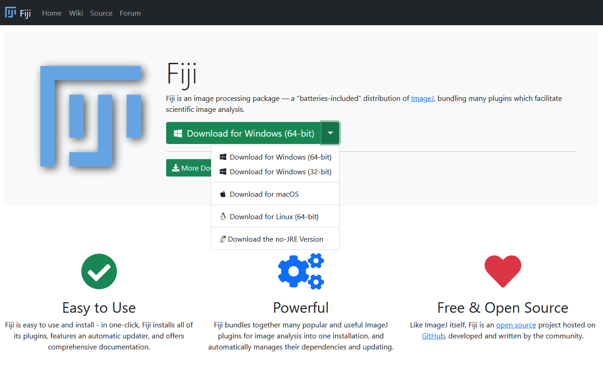
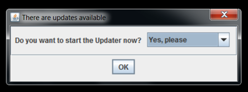
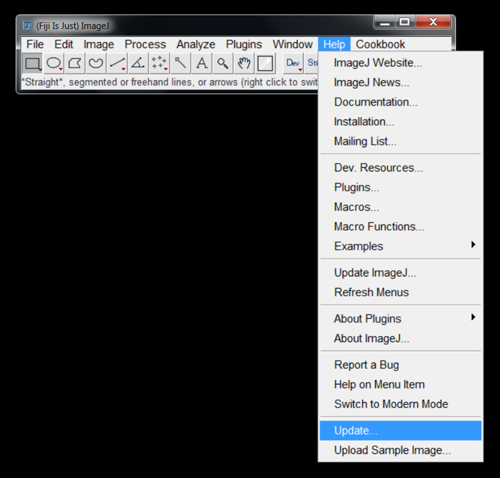

# Preparation For Introduction to Image Analysis Workshop

Please read the following instructions carefully to prepare for the workshop. Completing these steps prior to the workshop is essential to ensure we stay on schedule. If you are having any trouble with the below instructions, please reach out for help:
* For issues with FIJI or QuPath, contact Dave (David.Barry@crick.ac.uk)
* For issues with CellProfiler or conda, contact Rocco (rocco.dantuono@crick.ac.uk)

## Installing FIJI

1. Download FIJI from [here](https://fiji.sc/).

   

2. To avoid any permissions issues, install FIJI is in your home directory:
   * PC: `C:\users\<your user name>`
   * Mac: `/Users/<your user name>`

   > **WARNING: FIJI *must* be installed in a location where it has write permission - otherwise, it cannot update itself**

3. Start FIJI and allow the updater to run:

   

4. (Optional) If the updater does not run automatically, select `Help > Update`:

   

5. If FIJI produces any error messages, it is most likely because it does not have the necessary permissions to update itself - return to step #2 and double-check the location of the installation.

## Installing QuPath

1. Download QuPath from [here](https://qupath.github.io/).

## Installing CellProfiler

1. Download CellProfiler from [here](https://cellprofiler.org/releases)
2. Get started with CellProfiler by following [these instructions](https://cellprofiler.org/getting-started).

## Installing conda

1. Install Miniconda by following the installation instructions for your operating system at [this page](https://docs.anaconda.com/free/miniconda/miniconda-install/)
2. Please check the installation worked properly by opening the Terminal (MacOS) or Anaconda Prompt (Windows) and typing `conda list`. If conda has been installed correctly, a list of installed packages appears.
3. You can find a conda "cheat sheet" [here](https://conda.io/projects/conda/en/latest/_downloads/843d9e0198f2a193a3484886fa28163c/conda-cheatsheet.pdf), which you may find useful for reference during the workshop.
