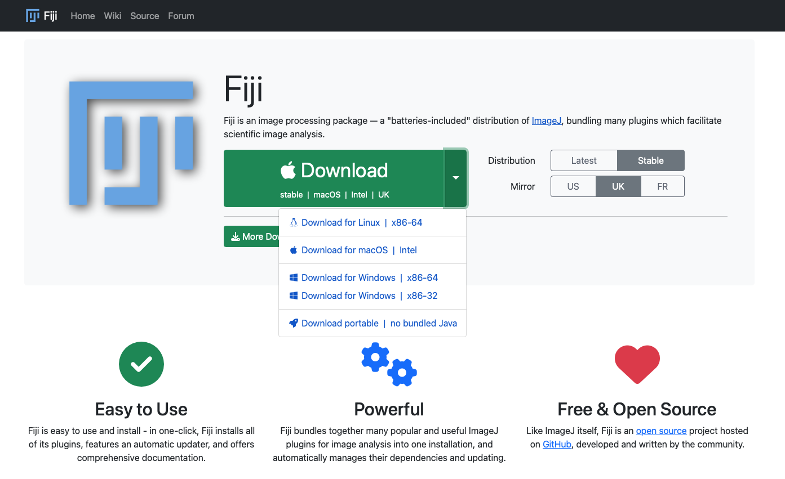
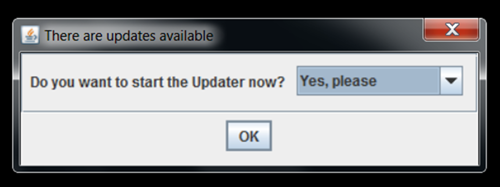
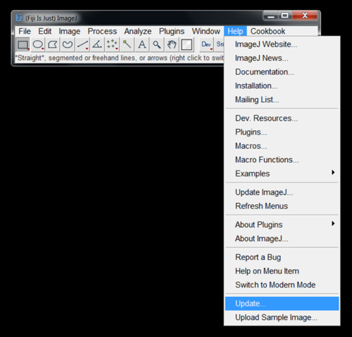
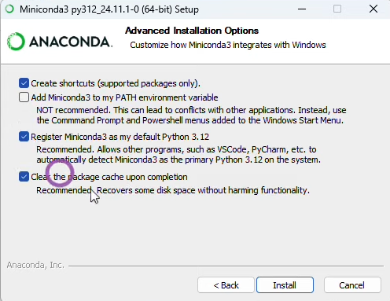

# Preparation For Introduction to Image Analysis Workshop

Please read the following instructions carefully to prepare for the workshop. Completing these steps prior to the workshop is essential to ensure we stay on schedule. If you are having any trouble with the below instructions, please reach out for help:
* For issues with FIJI contact Dave (David.Barry@crick.ac.uk)
* For issues with CellProfiler or conda, contact Rocco (rocco.dantuono@crick.ac.uk)
* For issues with QuPath, contact Sara (sara.salgueirotorres@crick.ac.uk)

## Installing FIJI

1. Download FIJI from [here](https://fiji.sc/). Please select the **Stable** distribution (as opposed to the Latest one).

   

2. To avoid any permissions issues, install FIJI is in your home directory:
   * PC: `C:\users\<your user name>`
   * Mac: `/Users/<your user name>`

   > **WARNING: FIJI *must* be installed in a location where it has write permission - otherwise, it cannot update itself**

3. Start FIJI and allow the updater to run:

   

4. (Optional) If the updater does not run automatically, select `Help > Update`:

   

5. If FIJI produces any error messages, it is most likely because it does not have the necessary permissions to update itself - return to step #2 and double-check the location of the installation.

## Installing QuPath

Download the latest version of QuPath (v0.7) from [here](https://qupath.github.io/).

* The first time you open QuPath, you will be prompted to select your User Directory. We recommend you create a folder (e.g., `qupath_v07`) somewhere locally.
   * This is where your software extensions and global scripts, amongst others, will be stored.
 
> **💡 We highly recommend you bring a mouse with you! It will make your life easier when working with QuPath.**

## Installing CellProfiler

1. Download CellProfiler from [here](https://cellprofiler.org/releases)
2. Get started with CellProfiler by following [these instructions](https://cellprofiler.org/getting-started).

## Installing conda

1. Install Miniconda by following the installation instructions for your operating system at [this page](https://www.anaconda.com/docs/getting-started/miniconda/install). Choosing the "Graphical installer" option should make it easier, if you're not familiar with using the terminal. 
2. [Windows users only] When prompted, make sure to select "Register Miniconda3 as my default Python 3.13", if not already selected.

   
   
3. Please check that the installation worked properly by opening the Terminal (MacOS) or Anaconda PowerShell Prompt (Windows) and typing `conda list`. If conda has been installed correctly, a list of installed packages appears.

FAQ: "What should I do if I already have `conda` installed on my machine?"

Please make sure that your `conda` installation is up to date. To do so, run the following command:
```
conda --version
```
If this returns a version older than `23.10.0`, please update your `conda` by running:
```
conda update -n base conda
